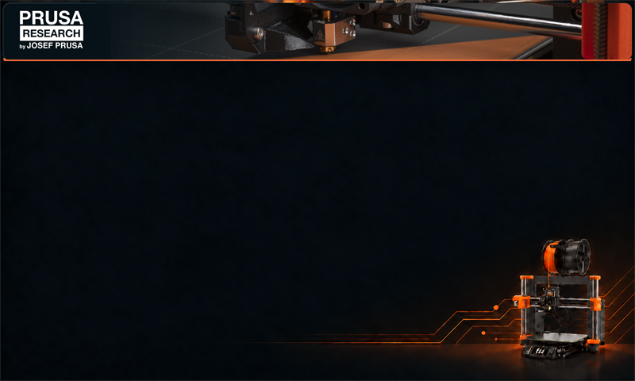
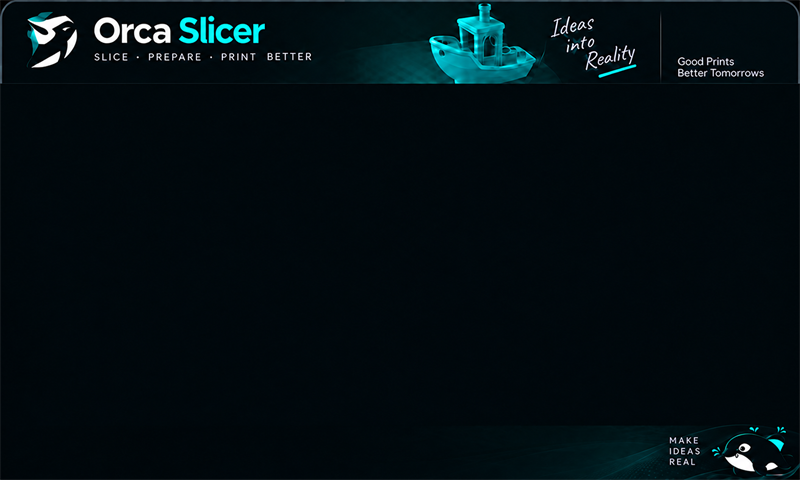
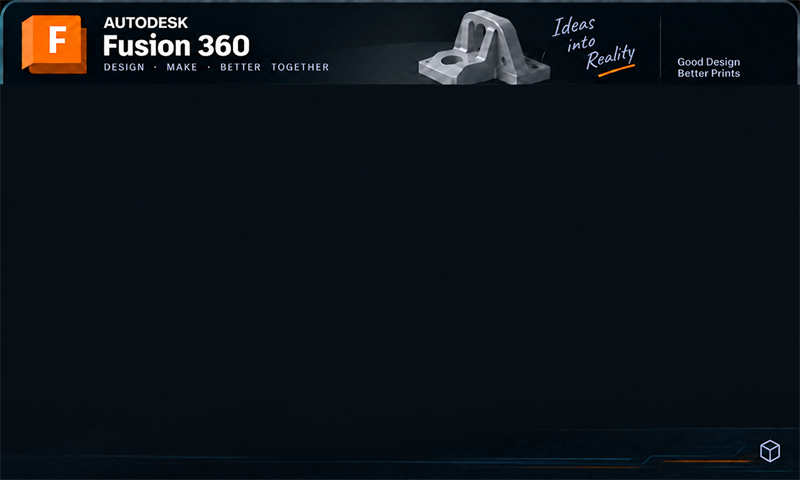
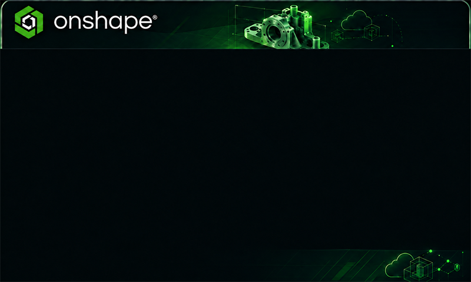
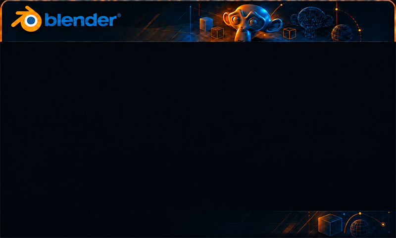

# MacroDesk

MacroDesk is a browser-customizable 7-inch touch control deck for the
**Waveshare ESP32-S3-Touch-LCD-7**. It appears to the computer as a standard USB
keyboard and sends shortcuts for creative and engineering applications.

Users do not need VS Code, Arduino IDE, or firmware knowledge. Flash the bundled
firmware once, then choose templates, arrange buttons, edit shortcuts, and send
the result to the device from MacroDesk Studio in Chrome or Edge.

## Current status

- Browser firmware flashing is working on real hardware.
- Browser-to-device profile transfer is working on real hardware.
- A **PrusaSlicer + Onshape** project has been sent, restarted, and loaded
  successfully on the board.
- Studio provides templates for **PrusaSlicer, OrcaSlicer, Fusion 360, Onshape,
  and Blender**. Any two can be paired on one deck.
- Both left and right sidebars are customizable. Left-side keys have editable
  destinations, while the right sidebar has editable grid dimensions.
- Each left-sidebar entry can open its own page of keys. Templates populate page
  1; pages 2-8 start empty so old buttons cannot unexpectedly reappear.
- Built-in and uploaded backgrounds are included when a project is sent to the
  board.
- The board validates the transferred data before replacing the working profile
  and falls back to built-in OrcaSlicer + Fusion 360 profiles if no valid custom
  profile exists.

| PrusaSlicer | OrcaSlicer | Fusion 360 |
|---|---|---|
|  |  |  |

| Onshape | Blender |
|---|---|
|  |  |

The background files intentionally contain only header/decorative artwork. The
firmware and Studio draw the cards, labels, icons, sidebars, and footer on top,
so edited controls are not duplicated over an old image.

## What you need

| Item | Purpose |
|---|---|
| [Waveshare ESP32-S3-Touch-LCD-7](https://www.waveshare.com/esp32-s3-touch-lcd-7.htm?sku=27078) | 800 x 480 display, touch controller, ESP32-S3, 16 MB flash, and 8 MB PSRAM |
| Chrome or Edge on a desktop computer | Web Serial is required for flashing and sending projects |
| USB-C data cable | Connects the board's `USB TO UART` port for setup |
| Second USB-C data cable, recommended | Connects the native `USB` port for keyboard output while the UART cable remains attached |

The two USB-C ports have different jobs:

| Board port | Used for |
|---|---|
| `USB TO UART` (CH343) | Flashing firmware, sending Studio projects, and serial diagnostics |
| Native `USB` | USB HID keyboard output to the computer being controlled |

Opening the CH343 serial port may reset the board. This is normal. The firmware
waits for the connection to settle before accepting a project.

## Quick start

### 1. Start the local website

Web Serial and background conversion do not work correctly from a `file://`
page. Serve the repository root over localhost:

```powershell
cd "D:\Macro Dash"
py -m http.server 8000
```

Then use Chrome or Edge to open:

- Firmware flasher: `http://localhost:8000/web/flash.html`
- MacroDesk Studio: `http://localhost:8000/web/`

If port 8000 is already in use, choose another port and use the same port in
both URLs.

### 2. Flash the firmware once

1. Connect a data cable to the board port marked **USB TO UART**.
2. Open `http://localhost:8000/web/flash.html`.
3. Keep **Bundled build** selected and click **Connect and flash**.
4. Select `USB-Enhanced-SERIAL CH343` in the browser port chooser.
5. Wait for verification and the board restart.

The flasher writes the merged, runtime-enabled image at address `0x0`:

[`prebuilt/MacroDesk-esp32s3-touch-lcd-7.bin`](prebuilt/MacroDesk-esp32s3-touch-lcd-7.bin)

An erase is normally unnecessary. Erasing the whole flash also removes the
custom project already stored in the FAT partition.

### 3. Customize and send a project

1. Open `http://localhost:8000/web/`.
2. Choose two application templates.
3. Edit the main grid, left sidebar, right sidebar, quick action, colors,
   shortcuts, icons, and backgrounds.
4. Click **Send to device**.
5. Select the board's **USB TO UART / CH343** port.
6. Wait for sending, verification, and the automatic restart. Do not unplug the
   UART cable while the transfer is in progress.
7. Connect the native **USB** port to the computer you want to control.

After the first firmware flash, subsequent customization only requires steps
1-7 above. You do not need to flash or compile the firmware again.

The project transfer runs at **115200 baud**. Studio sends 512-byte chunks and
waits for firmware acknowledgement every 4 KiB. This flow control is required
for reliable transfer of the approximately 1.55 MB project through the CH343.

## Export, import, and Send to device

These commands serve different purposes:

| Command | Result |
|---|---|
| **Export .macrodesk** | Downloads an editable JSON backup to the computer; it does not change the board |
| **Import** | Loads a `.macrodesk` project into Studio for further editing |
| **Send to device** | Builds a binary runtime bundle in memory and installs it on the connected board |
| **Flash firmware** | Installs or updates the base firmware; normally needed only once or after firmware changes |

Studio also saves the current project in browser local storage. Export a
`.macrodesk` file when you want a portable backup or want to share the layout
with another user.

## Studio capabilities

- Pair any two templates: PrusaSlicer, OrcaSlicer, Fusion 360, Onshape, or
  Blender.
- Edit labels, shortcuts/actions, text icons, accent colors, and enabled state.
- Upload PNG, JPG, or SVG backgrounds; Studio crops/renders them to 800 x 480.
- Drag keys to swap their positions.
- Configure eight left-sidebar pages independently.
- Change left-sidebar labels, icons, colors, order, and destination pages.
- Select a 2- or 3-column by 2- or 3-row right-sidebar layout.
- Enable or disable the quick-action card.
- Import/export versioned `.macrodesk` projects.
- Install both profiles and their RGB565 backgrounds directly over Web Serial.

Supported runtime actions include keyboard shortcuts, Fusion-style command
search, literal text, page/profile navigation, and disabled keys.

## Runtime storage and safety

Studio sends an `MDB1` binary bundle over the CH343 serial connection. The
firmware writes it to a temporary FAT file, verifies its size, CRC32, format,
and counts, then promotes it to `/macrodesk.bin` and restarts.

```text
MacroDesk Studio project
  |-- controls, pages, actions, and strings
  |-- profile 1 background -> 800 x 480 RGB565
  `-- profile 2 background -> 800 x 480 RGB565
                    |
                    v Web Serial / CH343 / 115200
             /macrodesk.tmp
                    |
                    v validate and promote
             /macrodesk.bin -> restart -> runtime profiles
```

The old file is retained as a backup during replacement. If the new bundle is
invalid or missing, the firmware continues with its compiled fallback profiles
instead of leaving the device unusable. The runtime format is documented in
[`RUNTIME_FORMAT.md`](firmware/MacroDeckUI/RUNTIME_FORMAT.md).

## Important current limitations

- Uploaded bitmap button icons appear in Studio but are not yet transferred as
  bitmap icons. Firmware uses the text icon or first label character instead.
- Firmware fonts do not include most Thai/Unicode glyphs. ASCII button labels
  are currently the safest choice.
- The special Orca jog-pad action is not exposed by Studio yet; a customized
  Move key behaves as a normal shortcut.
- Templates populate only sidebar page 1. Pages 2-8 are intentionally empty
  until the user adds keys.
- Shortcuts can depend on the active application context and the user's own app
  preferences. Onshape sketch/Part Studio actions are especially contextual.
- The runtime bundle is limited to 2 MiB.

## Troubleshooting

| Symptom | What to do |
|---|---|
| **Send to device** or the port chooser is unavailable | Use desktop Chrome or Edge and open Studio through `http://localhost` or HTTPS, not `file://`. |
| `The canvas has been tainted by cross-origin data` | Close the `file://` page and reopen `http://localhost:8000/web/`. Do not disable browser security. |
| No serial port appears | Connect the `USB TO UART` port with a data cable, install/check the CH343 driver, and close Arduino Serial Monitor or any program holding the port. |
| Stuck at `Waiting for device` | Make sure the runtime-enabled prebuilt firmware was flashed, select the CH343 port, close other serial tools, and retry after the board has restarted. |
| Progress reaches 100% and returns to sending | Update to the current firmware and Studio together. The reliable protocol uses 115200 baud, a 64 KiB firmware RX buffer, and progress acknowledgement every 4 KiB. |
| `Device response timed out` | Close other serial clients, unplug/reconnect the UART cable, reload Studio from localhost, and send again. If old firmware is installed, flash the bundled build first. |
| The display turns off during connection | Opening CH343 can reset the board. Wait for it to boot; Studio allows time for this before transfer. |
| The project sends but old profiles return | Flash the current runtime-enabled prebuilt, then send the project again. A full-chip erase deletes `/macrodesk.bin`. |
| Touch works but no shortcut reaches the computer | Connect the native `USB` port and give the target application keyboard focus. The UART port does not provide HID output. |
| A key works in the wrong application context | Review the shortcut in Studio. Some Fusion 360 and Onshape commands require a sketch, selection, or specific workspace. |

For diagnostics, close Studio before opening a serial monitor because only one
program can own the COM port at a time. Use **115200 baud** with the current
firmware. Useful protocol commands are `MDINFO` and `MDERASE`; `MDERASE` removes
the installed custom runtime profile.

## Building firmware from source

The ready-made firmware is recommended for normal users. Developers need:

| Component | Tested version |
|---|---|
| Arduino IDE 2.x or bundled `arduino-cli` | Current Arduino IDE toolchain |
| Espressif ESP32 board package | 3.0.7 |
| `ESP32_Display_Panel` | 1.0.0 |
| `ESP32_IO_Expander` | 1.0.1 |
| `esp-lib-utils` | 0.1.2 |
| LVGL | **8.4.0**; LVGL 9 is not supported |

Required board settings:

| Setting | Value |
|---|---|
| Board | `Waveshare ESP32-S3-Touch-LCD-7` |
| Flash Size | `16MB (128Mb)` |
| Partition Scheme | `16M Flash (3MB APP/9.9MB FATFS)` |
| PSRAM | Enabled |
| USB Mode | default / USB-OTG TinyUSB |

Required LVGL settings include:

```c
#define LV_COLOR_DEPTH 16
#define LV_COLOR_16_SWAP 0
#define LV_MEM_SIZE (48U * 1024U)
#define LV_FONT_MONTSERRAT_12 1
#define LV_FONT_MONTSERRAT_14 1
#define LV_FONT_MONTSERRAT_16 1
#define LV_FONT_MONTSERRAT_26 1
```

Example PowerShell build:

```powershell
$cli = "$env:LOCALAPPDATA\Programs\Arduino IDE\resources\app\lib\backend\resources\arduino-cli.exe"
$fqbn = "esp32:esp32:waveshare_esp32_s3_touch_lcd_7:PSRAM=enabled,FlashSize=16M,PartitionScheme=app3M_fat9M_16MB,USBMode=default"

& $cli compile --fqbn $fqbn --export-binaries firmware\MacroDeckUI
py tools\make_prebuilt.py
```

`tools/make_prebuilt.py` creates the canonical merged image in `prebuilt/` and
a compatibility copy in `firmware/prebuilt/`. Both are flashed at address
`0x0`. After updating the firmware, also bump the prebuilt cache query in the
web flasher so browsers do not reuse an older image.

The current firmware sets the UART RX buffer to 64 KiB before
`Serial.begin(115200)`. Keep the firmware and Studio transport settings in sync.

## Repository layout

```text
web/
  index.html, app.js, styles.css  MacroDesk Studio
  flash.html, flash.js           browser firmware flasher

firmware/MacroDeckUI/
  MacroDeckUI.ino                board, display, USB HID, and serial startup
  macro_deck_ui.c/.h             deck rendering and touch behavior
  macro_deck_profiles.c          built-in fallback profiles
  macro_deck_runtime.cpp/.h      runtime bundle receiver, validator, and loader
  RUNTIME_FORMAT.md              runtime binary/protocol specification
  assets/                        clean 800 x 480 source backgrounds
  ui_*_rgb565.c                  generated built-in RGB565 images

prebuilt/                        canonical browser-ready merged firmware
firmware/prebuilt/               compatibility copy of the merged firmware
templates/                       design templates and layout guides
tools/macrodesk_to_c.py          optional .macrodesk-to-C converter
tools/png_to_rgb565.py           PNG-to-RGB565 converter
tools/make_prebuilt.py           merged firmware builder
```

The web runtime path is the normal customization workflow. The older
`.macrodesk`-to-C converter remains useful for reproducible profiles compiled
directly into firmware, but it does not yet cover every runtime layout feature.

## Keyboard behavior

The native USB port identifies the deck as a USB keyboard. Click inside the
target application's window before using the touchscreen so that it has input
focus. Shortcut strings support modifiers such as `Ctrl`, `Shift`, `Alt`, and
`Win`, named keys, function keys, literal text, and application search actions.

The board routes native USB through the CH422G IO expander by driving `EXIO5`
low during boot. This board-specific step is required for Windows to enumerate
the keyboard.

## License and trademarks

MacroDesk is licensed under the **GNU General Public License v3.0**. See
[`LICENSE`](LICENSE).

MacroDesk is an independent project and is not affiliated with or endorsed by
Prusa Research, OrcaSlicer, Autodesk, Onshape, Blender, Waveshare, or Espressif.
Product names, logos, and application artwork belong to their respective owners
and are used to identify the software controlled by the deck. Review each
owner's brand policy before commercial distribution.

The display/touch adapter and board configuration are based on Waveshare's
ESP32-S3-Touch-LCD-7 LVGL example and Espressif libraries.
