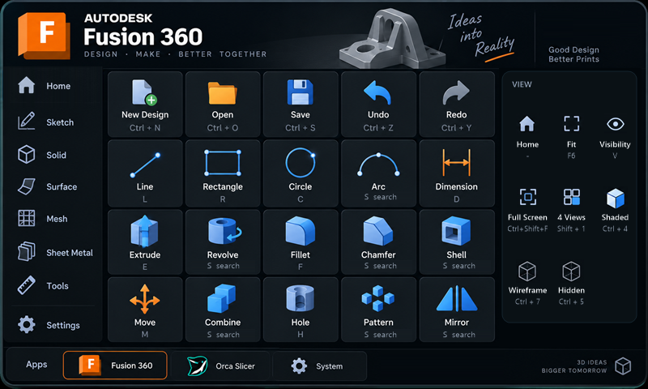
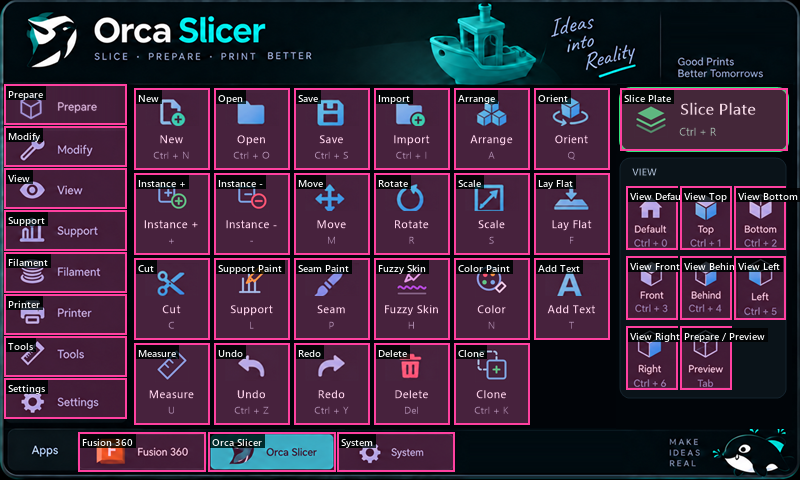
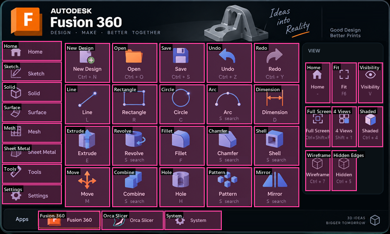
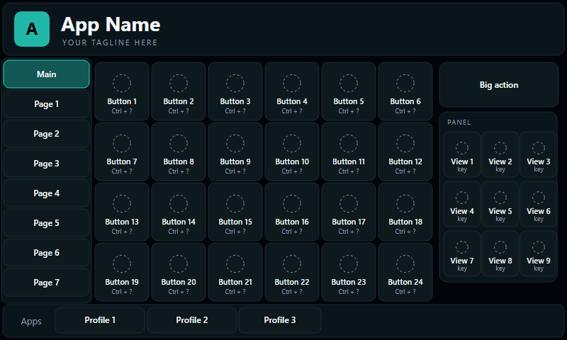

# MacroDesk

A 7-inch touch control deck for **Fusion 360** and **OrcaSlicer**, built on the
Waveshare ESP32-S3-Touch-LCD-7. It plugs into a PC over USB and shows up as a
normal keyboard: every button on the screen sends that program's own keyboard
shortcut, so the PC needs no driver and no companion app.

| OrcaSlicer | Fusion 360 |
|---|---|
|  |  |

## Features

- **Two profiles**, switched from the bottom bar: OrcaSlicer and Fusion 360.
- **OrcaSlicer**: a 6 × 4 grid of 23 tools, a Slice Plate button, eight camera
  views, and a jog pad that moves the selected model 10 mm or 1 mm per tap.
- **Fusion 360**: sketch and solid tools, visual styles, Fit (F6) and more.
  Commands with no default shortcut, such as Revolve or Shell, are typed into
  Fusion's `S` command search automatically.
- **Sidebar pages** on both profiles: seven extra pages each, for example
  Modify, Filament (set filament 1–9) and Printer (Print Plate, Export G-code)
  on Orca, and Sketch, Solid, Surface, Mesh and Sheet Metal on Fusion.
- **Easy to customize**: every button is one line of text in one file, for
  example `{LV_SYMBOL_SAVE, "Save", "Ctrl+S"}`.
- Plug-and-play USB keyboard with no driver or companion app. The shortcuts are
  the Windows/Linux ones (`Ctrl`). On macOS most of them would need `Cmd`.

## Hardware

| Part | Notes |
|---|---|
| [Waveshare ESP32-S3-Touch-LCD-7](https://www.waveshare.com/esp32-s3-touch-lcd-7.htm?sku=27078) | 800 × 480 RGB LCD, GT911 capacitive touch, 16 MB flash, 8 MB PSRAM |
| 2 × USB-C data cables | One for the keyboard, one for flashing and logs |

The product link goes to Waveshare's own store. It is not an affiliate link,
and this project is not sponsored by Waveshare.

The board has **two USB-C ports**, and they do different things:

| Port | Used for |
|---|---|
| `USB TO UART` (CH343) | Flashing and the serial log. Shows up as a COM port. |
| `USB` (native ESP32-S3) | **The keyboard.** Plug this one into the PC you want to control. |

Keep both plugged in while developing. For daily use only the native port is
needed.

> **Board quirk:** the native USB data lines (GPIO19/20) are shared with the CAN
> transceiver through the CH422G IO expander. The firmware drives `EXIO5` low at
> boot to route them to USB. Without that step Windows never sees the keyboard,
> even though TinyUSB reports that it started.

## Quick start: flash the ready-made firmware

No Arduino setup is needed for this path.

1. Download
   [`firmware/prebuilt/MacroDesk-esp32s3-touch-lcd-7.bin`](firmware/prebuilt/MacroDesk-esp32s3-touch-lcd-7.bin).
2. Connect the board's `USB TO UART` port to the PC.
3. Flash the file at address **0x0** with either tool:
   - **In the browser** (Chrome or Edge): open Espressif's
     [esptool-js](https://espressif.github.io/esptool-js/) web flasher,
     click *Connect*, pick the COM port, set the flash address to `0x0`, choose
     the `.bin` file and click *Program*.
   - **Command line**:

     ```sh
     pip install esptool
     python -m esptool --chip esp32s3 --port <COM port> --baud 921600 write_flash 0x0 MacroDesk-esp32s3-touch-lcd-7.bin
     ```

4. Press the board's reset button, then plug the native `USB` port into the PC
   you want to control.

The file is a single image containing the bootloader, partition table and app.
After changing the firmware, regenerate it with `python tools/make_prebuilt.py`.

## Building from source

### 1. Toolchain

| Component | Version tested |
|---|---|
| Arduino IDE 2.x or `arduino-cli` | – |
| esp32 board package (Espressif) | 3.0.7 |
| `ESP32_Display_Panel` | 1.0.0 |
| `ESP32_IO_Expander` | 1.0.1 |
| `esp-lib-utils` | 0.1.2 |
| `lvgl` | **8.4.0** (LVGL 9 is not supported) |

Install the libraries from the Arduino Library Manager.

### 2. `lv_conf.h`

LVGL reads its configuration from `lv_conf.h` placed next to the `lvgl` folder
in your Arduino `libraries` directory. Start from the template shipped with
`ESP32_Display_Panel` and check these values:

```c
#define LV_COLOR_DEPTH 16
#define LV_COLOR_16_SWAP 0            // the background images depend on this
#define LV_MEM_SIZE (48U * 1024U)     // see "Memory" below
#define LV_FONT_MONTSERRAT_12 1
#define LV_FONT_MONTSERRAT_14 1
#define LV_FONT_MONTSERRAT_16 1
#define LV_FONT_MONTSERRAT_26 1
```

### 3. Board settings

| Setting | Value |
|---|---|
| Board | `Waveshare ESP32-S3-Touch-LCD-7` |
| Flash Size | `16MB (128Mb)` |
| Partition Scheme | `16M Flash (3MB APP/9.9MB FATFS)` |
| PSRAM | `Enabled` (**required**, otherwise the framebuffer allocation fails and the board reboots) |
| USB Mode | default (USB-OTG / TinyUSB) |

### 4. Build and flash

In the Arduino IDE, open `firmware/MacroDeckUI/MacroDeckUI.ino`, pick the
`USB TO UART` COM port and press Upload.

With `arduino-cli`:

```sh
FQBN="esp32:esp32:waveshare_esp32_s3_touch_lcd_7:PSRAM=enabled,FlashSize=16M,PartitionScheme=app3M_fat9M_16MB"

arduino-cli compile --fqbn "$FQBN" --export-binaries firmware/MacroDeckUI
arduino-cli upload  --fqbn "$FQBN" --port <COM port or /dev/tty...> \
  --input-dir firmware/MacroDeckUI/build/esp32.esp32.waveshare_esp32_s3_touch_lcd_7
arduino-cli monitor --port <same port> --config baudrate=115200
```

A good boot prints:

```text
USB HID keyboard ready (EXIO5 LOW)
Macro Deck UI ready
```

Every tap prints what it did, for example `Touch: Fit -> F6`, which is the
quickest way to check touch zones.

## Using it

1. Plug the native USB port into the PC. It appears as a USB keyboard named
   `MacroDesk Control Deck`.
2. Pick **Fusion 360** or **Orca Slicer** in the bottom bar.
3. Click once inside the program's 3D view so that it has keyboard focus, then
   use the deck.

Notes:

- **Orca → Move** opens the jog pad. The arrows move the selected model, the
  centre button switches between 10 mm and 1 mm, and holding an arrow repeats
  it.
- **Orca → View** page: the orange buttons only make sense in Preview. In
  Prepare the same keys run other commands (`L` = support painting,
  `C` = cut, arrows = move the model).
- **Fusion `S search` buttons** need Fusion's user interface in English, because
  they type the command name.

## Customizing

### Change what a button does, or add a button

**Every button lives in
[`firmware/MacroDeckUI/macro_deck_profiles.c`](firmware/MacroDeckUI/macro_deck_profiles.c).**
You don't need to touch any other file.

A button is `{icon, label, keys}`, and `keys` is written the way you would say
it:

```c
{LV_SYMBOL_SAVE, "Save", "Ctrl+S"}
{"P", "Print Plate", "Ctrl+Shift+G"}
{LV_SYMBOL_IMAGE, "Fit", "F6"}
{"R", "Revolve", "search:Revolve"}   // Fusion: press S, type "Revolve", Enter
```

| In `keys` | Meaning |
|---|---|
| `Ctrl+`, `Shift+`, `Alt+`, `Win+` | Modifiers, in any combination |
| a single character: `A`, `5`, `+`, `?`, `]` | That key |
| `Del`, `Esc`, `Tab`, `Enter`, `Space`, `Backspace`, `Home`, `End`, `PgUp`, `PgDn`, `Up`, `Down`, `Left`, `Right`, `F1`–`F12` | Named keys |
| `search:Name` | Fusion command search: presses `S`, types `Name`, presses Enter |

An optional 4th field sets the icon colour on sidebar pages, for example
`{"B", "Mesh Boolean", "B", 0x55BFFF}`. If a key string is wrong, the serial log
prints `Unknown key ...`.

There are two kinds of buttons:

- **Sidebar-page buttons** (`orca_modify[]`, `fusion_solid[]` and so on) are
  drawn by LVGL. Add, remove or reorder lines and the page redraws itself. No
  artwork or coordinates are needed.
- **Buttons on the main image pages** (`orca_zones[]`, `fusion_zones[]`) are
  invisible touch areas placed over a button painted in the background PNG.
  Each line has a rectangle, for example `{ORCA_CELL(2, 1), {...}}` for
  column 2, row 1. If you change the picture, keep the rectangles on top of the
  painted buttons.

To check where every touch area is, run `python tools/make_layout_guides.py`.
It draws the rectangles over the artwork:

| Orca touch areas | Fusion touch areas |
|---|---|
|  |  |

### Change a background, or design your own

1. Start from the brand-free template
   [`templates/deck_template_800x480.svg`](templates/deck_template_800x480.svg)
   (Figma, Inkscape and Illustrator can open it), or edit the existing PNG in
   `firmware/MacroDeckUI/assets/`. Every box in the template sits exactly on a
   touch-area rectangle that already exists in the code.

   

2. Export an **800 × 480** PNG into `firmware/MacroDeckUI/assets/`.
3. Convert it to the C array the firmware embeds:

   ```sh
   pip install pillow
   python tools/png_to_rgb565.py firmware/MacroDeckUI/assets/ui_orca_800x480.png
   ```

   This rewrites `firmware/MacroDeckUI/ui_orca_rgb565.c`. For a new image,
   `--name ui_myapp` produces `ui_myapp_rgb565.c` with the symbol
   `ui_myapp_rgb565[]`.
4. Point the profile at the image in `macro_profiles[]` at the bottom of
   `macro_deck_profiles.c`, then update the touch-area rectangles if buttons
   moved.
5. Build and flash.

Each image uses 768,000 bytes (800 × 480 × 2) of the 3 MB app partition. The
sketch uses about 71% today, so about one more full-screen image fits. For
more, pick a larger app partition, or load images from the FAT partition or SD
card into PSRAM at boot.

### Add a whole new profile (for example Blender)

1. Design an 800 × 480 background from the template and convert it (see above).
2. In `macro_deck_profiles.c`, copy the Orca block: a `*_zones[]` array, the
   page arrays and a `*_pages[]` list. Rename them and fill in the keys.
3. Add an entry to `macro_profiles[]` and give it a bottom-bar button with
   `MACRO_ACTION_PROFILE` and its index (the "System" slot is free).

## How the firmware is put together

```text
firmware/MacroDeckUI/
├── macro_deck_profiles.c    ALL buttons, pages and touch areas  ← edit this
├── macro_deck_ui.h          button / zone / page / profile types
├── macro_deck_ui.c          engine: touch areas, sidebar pages, jog pad, profiles
├── MacroDeckUI.ino          board + USB bring-up, turns "Ctrl+S" into key presses
├── ui_*_rgb565.c            background images as C arrays (generated, don't edit)
├── assets/                  800 × 480 PNG sources of the backgrounds
├── esp_lv_adapter_arduino.* LVGL display/touch adapter (from Waveshare)
└── esp_panel_board_custom_conf.h   board pin/timing config (Espressif, Apache-2.0)
firmware/prebuilt/           ready-to-flash .bin
templates/                   design template and layout guides
tools/png_to_rgb565.py       PNG → C array converter
tools/make_layout_guides.py  draws the touch areas over the artwork
tools/make_prebuilt.py       rebuilds the ready-to-flash .bin from the build output
CLAUDE.md                    project notes for AI coding assistants
```

The screen has three layers:

1. **Background image.** Each profile is one full-screen 800 × 480 picture,
   stored as an RGB565 array in flash and copied into a PSRAM canvas when the
   profile changes.
2. **Invisible touch areas.** Transparent LVGL buttons placed over the buttons
   painted in the image. They only highlight while pressed.
3. **LVGL overlays.** The sidebar highlight, the sidebar pages and the jog pad.
   Sidebar pages are built when opened and deleted when closed, because the
   LVGL heap is small.

A tap flows like this:

```text
touch → macro_button_t → engine (page / profile / jog pad) → on_button() in the .ino
      → send_keys("Ctrl+S") → USB HID keyboard
```

## Keyboard mapping sources

- OrcaSlicer: the official
  [keyboard shortcuts](https://github.com/OrcaSlicer/OrcaSlicer/wiki/keyboard-shortcuts)
  page, checked against the source code (`KBShortcutsDialog.cpp`,
  `GLCanvas3D.cpp`, `Gizmos/GLGizmo*.cpp`).
- Fusion 360: default shortcuts; Fit = F6 was confirmed on a real install.

## Memory

- **LVGL heap (`LV_MEM_SIZE`, 48 KB)** is the tightest limit. The largest
  sidebar page (12 buttons) brings it to about 80% used. The firmware prints
  `LVGL heap: …` on every page switch, so watch that line when adding buttons.
- **Flash**: the sketch uses about 2.23 MB of the 3 MB app partition.
- **PSRAM** holds the framebuffers and the 768 KB background canvas.

## Limitations and ideas

- A keyboard cannot rotate or scale by an angle or percentage, move along Z,
  add a plate or split objects in Orca. Those need a mouse (HID mouse) or a
  helper program on the PC.
- The Fusion *Home* view button is not mapped yet.
- Ideas: a System page with media and volume keys (USB Consumer Control), an
  HID mouse for orbit/pan/zoom, a Bambu Lab / Klipper print-status dashboard
  over Wi-Fi, and loading images and button layouts from the SD card.

## Troubleshooting

| Symptom | Fix |
|---|---|
| Taps show in the serial log but nothing happens on the PC | The native USB port is not connected, or the program's window does not have focus. |
| Windows does not list the keyboard | Use a data cable on the native port. Check the log for `USB HID keyboard ready (EXIO5 LOW)`. |
| Board reboot loop at start | PSRAM is not enabled in the board settings. |
| Red and blue swapped | `LV_COLOR_16_SWAP` must be `0`, or regenerate the images to match. |
| A button reacts in the wrong place | Its touch area doesn't match the picture. Run `tools/make_layout_guides.py`, or tap it and read the serial log. |
| `Unknown key ...` in the log | A `keys` string has a typo. See the table under *Customizing*. |
| Crash after adding many sidebar-page buttons | The LVGL heap is out of memory. Check the `LVGL heap` log line. |

## Stuck? Ask Claude

This repository includes a [`CLAUDE.md`](CLAUDE.md) that explains the project
to AI coding assistants. You don't need to know C to customize or fix the deck:

1. Install [Claude Code](https://claude.com/claude-code) and open this folder in
   it (in a terminal run `claude`, or use the VS Code extension).
2. Describe what you want in plain words, in any language, for example:
   - "Add a Blender profile with buttons for Grab, Rotate, Scale and Extrude."
   - "Change the Orca Delete button to send Ctrl+Delete."
   - "My deck resets when I open the Filament page. Here is the serial log: …"
   - "Flash the firmware to COM5."
3. Paste the serial monitor output when something goes wrong. It shows every tap
   and most errors.

Claude reads `CLAUDE.md` first, so it already knows the board quirks, how to
build and flash, and where the buttons are defined.

## License

MacroDesk is licensed under the **GNU General Public License v3.0**. See
[LICENSE](LICENSE).

You may use, modify and share it. If you distribute a modified version, for
example by publishing a fork or selling or giving away devices running your
firmware, you must release your source code under the same license.

`esp_panel_board_custom_conf.h` is © Espressif Systems and keeps its original
Apache-2.0 license, which is compatible with GPL-3.0.

## Trademarks

MacroDesk is an independent project. It is not affiliated with, endorsed by or
sponsored by Autodesk, Inc., the OrcaSlicer project, Bambu Lab, Waveshare or
Espressif. Fusion 360, Autodesk and all other product names and logos shown in
the screenshots and artwork belong to their respective owners and are used
only to identify the software the deck controls.

## Credits

- Display/touch adapter and board configuration are based on the official
  Waveshare ESP32-S3-Touch-LCD-7 LVGL 8 example.
- Built on [LVGL](https://lvgl.io), Espressif's
  [ESP32_Display_Panel](https://github.com/esp-arduino-libs/ESP32_Display_Panel)
  and the Arduino-ESP32 core.
