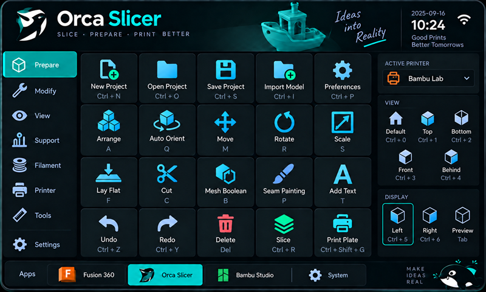

# MacroDesk handoff

อัปเดตล่าสุด: 2026-09-18

## ภาพรวม

โปรเจกต์ Touch Control Deck สำหรับ `Waveshare ESP32-S3-Touch-LCD-7` ความละเอียด 800 × 480 ใช้ LVGL 8, Arduino ESP32 และ Native USB HID Keyboard สำหรับควบคุม Fusion 360 และ OrcaSlicer

Repository: <https://github.com/XCRYZER01/MacroDesk>

โฟลเดอร์เฟิร์มแวร์หลัก: `firmware/MacroDeckUI`

## UI ล่าสุด



- Fusion 360 และ OrcaSlicer ใช้ layout เดียวกัน
- Header, sidebar, grid 5 × 4, right panel และ bottom app bar อยู่พิกัดเดียวกัน
- ภาพหน้าจอเก็บเป็น RGB888 และแปลงเป็น `lv_color_t` ใน PSRAM ขณะทำงาน เพื่อป้องกันสีแดง/น้ำเงินสลับบนจอจริง
- แตะ `Orca Slicer` หรือ `Fusion 360` ที่แถบล่างเพื่อเปลี่ยนโปรไฟล์

ไฟล์ภาพและข้อมูล:

- `firmware/MacroDeckUI/assets/ui_orca_800x480.png`
- `firmware/MacroDeckUI/ui_orca_rgb888.c`
- `firmware/MacroDeckUI/assets/ui_reference_800x480.png`
- `firmware/MacroDeckUI/ui_reference_rgb888.c`

## OrcaSlicer HID mapping ที่ตรวจแล้ว

อ้างอิงเอกสาร Keyboard Shortcuts ทางการของ OrcaSlicer:
<https://github.com/OrcaSlicer/OrcaSlicer/wiki/keyboard-shortcuts/f70839b8ad12f7e404ac1ced8f5dfb7d4e3686e7>

| แถว | ปุ่ม | HID ที่ส่ง |
|---|---|---|
| 1 | New Project | Ctrl+N |
| 1 | Open Project | Ctrl+O |
| 1 | Save Project | Ctrl+S |
| 1 | Import Model | Ctrl+I |
| 1 | Preferences | Ctrl+P |
| 2 | Arrange | A |
| 2 | Auto Orient | Q |
| 2 | Move | M |
| 2 | Rotate | R |
| 2 | Scale | S |
| 3 | Lay Flat | F |
| 3 | Cut | C |
| 3 | Mesh Boolean | B |
| 3 | Seam Painting | P |
| 3 | Add Text | T |
| 4 | Undo | Ctrl+Z |
| 4 | Redo | Ctrl+Y |
| 4 | Delete | Delete |
| 4 | Slice | Ctrl+R |
| 4 | Print Plate | Ctrl+Shift+G |

Right panel:

| ปุ่ม | HID ที่ส่ง |
|---|---|
| Default | Ctrl+0 |
| Top | Ctrl+1 |
| Bottom | Ctrl+2 |
| Front | Ctrl+3 |
| Behind | Ctrl+4 |
| Left | Ctrl+5 |
| Right | Ctrl+6 |
| Preview | Tab |

Sidebar ของ Orca เป็นหมวด UI ภายใน Control Deck และยังไม่ส่ง shortcut เพื่อป้องกันการเรียกคำสั่ง Orca ผิดรายการ

## USB HID สำคัญ

บอร์ดมี USB Type-C สองช่อง:

- `USB TO UART` ใช้แฟลชและ Serial Monitor ปัจจุบันเป็น `COM13`
- `USB Type-C / Native USB` ใช้ส่ง HID Keyboard ไปยัง Windows

GPIO19/20 แชร์ระหว่าง USB และ CAN ผ่าน CH422G ดังนั้นเฟิร์มแวร์ต้องสั่ง `EXIO5 LOW` หลัง `board->begin()` ก่อน `USB.begin()` หากไม่ทำ Windows จะไม่เห็น HID แม้ Serial จะแจ้งว่า TinyUSB เริ่มแล้ว

ข้อความบูตที่ถูกต้อง:

```text
USB HID keyboard ready (EXIO5 LOW)
Macro Deck UI ready
```

## Build และ Flash

Arduino CLI:

```powershell
$cli = 'C:\Users\User\AppData\Local\Programs\Arduino IDE\resources\app\lib\backend\resources\arduino-cli.exe'
$fqbn = 'esp32:esp32:waveshare_esp32_s3_touch_lcd_7:PSRAM=enabled,FlashSize=16M,PartitionScheme=app3M_fat9M_16MB,USBMode=default,CDCOnBoot=default,UploadMode=default'

& $cli compile --fqbn $fqbn --warnings none --export-binaries 'D:\Macro Dash\firmware\MacroDeckUI'
& $cli upload --port COM13 --fqbn $fqbn --input-dir 'D:\Macro Dash\firmware\MacroDeckUI\build\esp32.esp32.waveshare_esp32_s3_touch_lcd_7'
& $cli monitor --port COM13 --config baudrate=115200
```

ผล compile ล่าสุด (2026-09-18):

```text
Sketch uses 2937341 bytes (93%) of program storage space.
Global variables use 89352 bytes (27%) of dynamic memory.
```

ผล upload ล่าสุด (2026-09-18):

```text
Wrote 2937712 bytes (1395248 compressed) at 0x00010000 in 18.8 seconds
Hash of data verified.
```

## งานถัดไป

1. เสียบพอร์ต Native USB แล้วยืนยันว่า Windows เห็น HID และ shortcut ของ Orca ทำงานจริง
2. Implement HID mapping ของ Fusion 360 (ตอนนี้ `on_macro_action()` ส่ง shortcut เฉพาะตอนเลือกโปรไฟล์ Orca)
3. สร้างหน้าโปรไฟล์ Bambu Studio และ System
4. สร้าง sub-page สำหรับ sidebar ของ Orca
5. Program storage ใช้ไปแล้ว 93% ถ้าจะเพิ่มภาพ RGB888 เต็มจออีก (ภาพละ ~1.15 MB) ต้องบีบอัดภาพหรือย้ายไปเก็บใน FAT partition

## สถานะปัจจุบัน

- Source และ UI Orca ชุด shortcut ทางการ: พร้อมและ compile ผ่าน (ตรวจแล้วว่า `send_orca_shortcut()` ตรงกับตาราง mapping ด้านบน)
- เฟิร์มแวร์บนบอร์ด: แฟลช build ล่าสุด (mapping ทางการ) แล้วเมื่อ 2026-09-18 ผ่าน COM13, `Hash of data verified`
- Serial boot log หลังแฟลช: `USB HID keyboard ready (EXIO5 LOW)` และ `Macro Deck UI ready` ครบ
- COM13: ตรวจพบ USB-Enhanced-SERIAL CH343
- Native USB mux fix (`EXIO5 LOW`): implement แล้ว
- HID บน Windows: ขณะตรวจยังไม่พบอุปกรณ์ `VID_303A` (Espressif) ใน Device Manager น่าจะยังไม่ได้เสียบสายเข้าพอร์ต Native USB ต้องเสียบพอร์ตนั้นเข้า PC แล้วเช็กว่ามี `MacroDesk Control Deck` จากนั้นทดสอบกดปุ่มใน OrcaSlicer จริง
- Fusion 360 UI: สลับหน้าได้ แต่ HID mapping ของ Fusion ยังไม่ได้ implement ครบ
- Bambu Studio และ System: มีปุ่มใน bottom bar แต่ยังไม่มีหน้า profile
- Sidebar Orca: touch callback มีแล้ว แต่ยังไม่มีหน้า sub-page

## Git

Commit ล่าสุดที่ push แล้ว:

```text
86f4d4f feat: add Waveshare MacroDesk touch UI
```

มี uncommitted changes สำหรับ Orca UI, USB HID, USB/CAN mux และไฟล์ handoff นี้ ห้ามลบหรือ reset การแก้ไขใน worktree โดยไม่ตรวจ `git status` ก่อน

